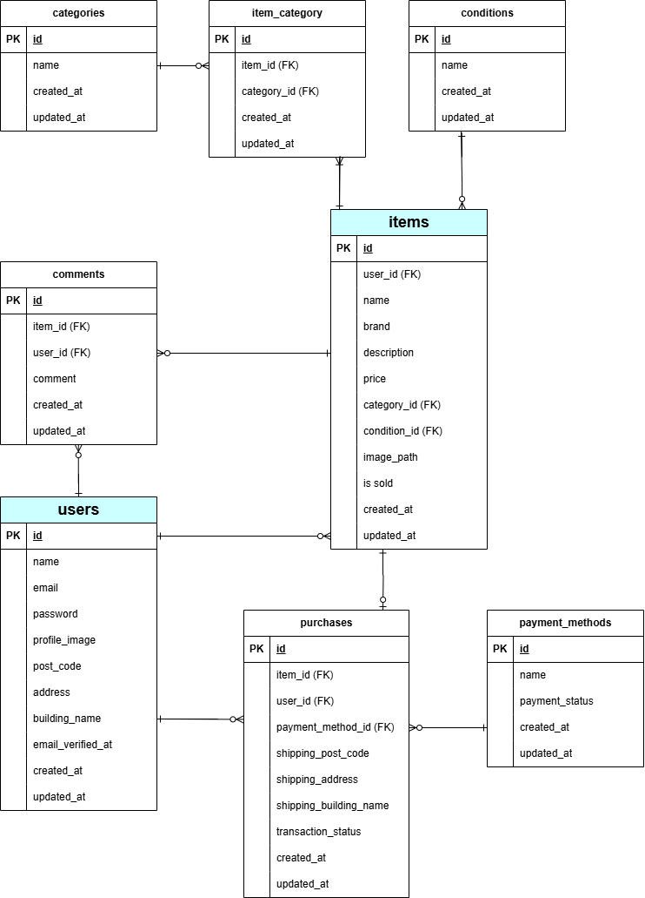

# 模擬案件（初級）　 coachtech フリマ（coachtech-pixel-market）

## 環境構築

リポジトリの設定

    ・　公開されているクローン元のリンク（SSH）をCodeボタンから取得

    ・　git clone リンク
            （コマンド実行後、lsで確認）

Docker の設定

    ・　docker-compose up -d --build

    ・　code .

    ・　docker-compose.yml の修正
            (1行目のversionをコメントアウト⇒修正後はコンテナ再構築)

Laravel のパッケージのインストール

    ・　docker-compose exec php bash

    ・　composer install
            （composer -vでインストールの確認）

    ・composer require stripe/stripe-php
                            （決済機能）

    ・composer require laravel/fortify
                            （認証機能）

.env ファイルの作成

    ・　cp .env.example .env

    ・　.envファイルの編集（以下の環境変数を追加）
            （修正後は、必ずphp artisan config:clearでキャッシュクリア）

        DB_CONNECTION=mysql
        DB_HOST=mysql
        DB_PORT=3306
        DB_DATABASE=laravel_db
        DB_USERNAME=laravel_user
        DB_PASSWORD=laravel_pass

        ### MailHogの設定（メール確認用）
        MAIL_MAILER=smtp
        MAIL_HOST=mailhog
        MAIL_PORT=1025
        MAIL_USERNAME=null
        MAIL_PASSWORD=null
        MAIL_FROM_ADDRESS="no-reply@verify-email-1.com" # 開発環境用のアドレスを設定
        MAIL_FROM_NAME="${APP_NAME}"

        ### Stripeキーの設定
        STRIPE_PUBLIC_KEY="pk_test_**************************"
        STRIPE_SECRET_KEY="sk_test_**************************"

view ファイルの作成

    ・　viewファイルの作成

    ・　php artisan make:controller

    ・　web.phpの修正

    ・　php artisan key:generate

マイグレーションの実行

    ・　php artisan make:model [モデル名] -m
            (マイグレーションテーブルとモデルを同時作成)

    ・　マイグレーションファイルの編集

    ・　php artisan migrate

ダミーデータの作成

    ・　php artisan make:factory

    ・　php artisan make:seeder

    ・　作成したシーダーファイルをDatabaseSeeder.phpに登録

    ・　php artisan db:seed

認証機能とシンボリックリンクの作成

    ・認証機能（Fortify）
        php artisan vendor:publish --provider="Laravel\Fortify\FortifyServiceProvider"

    ・シンボリックリンク
        php artisan storage:link

テスト環境の準備と実行

    ・全テスト実行
        vendor/bin/phpunit

    ・個別テスト実行
        vendor/bin/phpunit tests/Feature/[ファイル名]

## 使用技術

バージョン情報

    ・　ubuntu 24.04.2 LTS (GNU/Linux 6.6.87.1-microsoft-standard-WSL2 x86_64)

    ・　Docker Desktop 4.44.2

    ・　php:8.1-fpm

    ・　Laravel 8.83.29

    ・　Composer 2.8.10
            PHP version 8.1.33 (/usr/local/bin/php)

    ・　MySQL 8.0.26

開発言語

    ・　HTML5・CSS

    ・　Laravel PHP

    ・　Command Line

    ・　MySQL

    ・　JavaScript

## テーブル仕様書

## ER 図

## URL

開発環境 http://localhost/

phpMyAdmin http://localhost:8080/

mailhog http://localhost:8025
